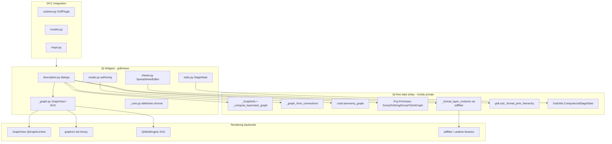
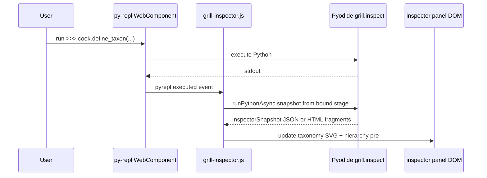
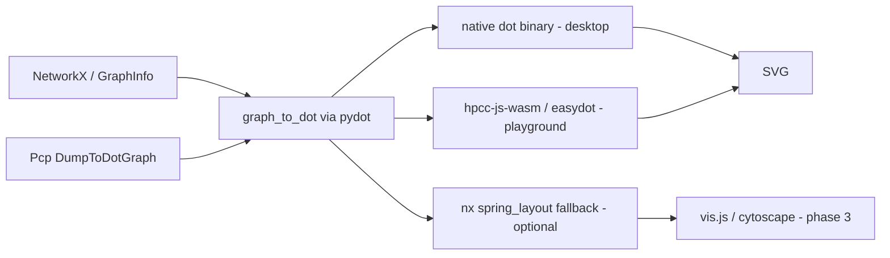

# Playground Views Integration Roadmap

Reference plan for bringing [`grill.views`](grill/views/) inspection building blocks into the
interactive Pyodide playground ([PR #51](https://github.com/thegrill/grill/pull/51)).

**Branch:** `cursor/playground-views-inspect-be4f` (stacked on `cursor/docs-playground-pyrepl-a03b`)

---

## Context

[PR #51](https://github.com/thegrill/grill/pull/51) adds a browser REPL via [`sphinx-pyrepl-web`](https://github.com/chrizzFTD/sphinx-pyrepl-web) on branch [`cursor/docs-playground-pyrepl-a03b`](https://github.com/thegrill/grill/tree/cursor/docs-playground-pyrepl-a03b). The playground preloads:

- `grill` (in-tree wheel)
- `grill-usd-core==26.8` (WASM `pxr`, no imaging/Hydra)
- `grill-names>=2.6.0`

It demonstrates **authoring** (`cook.fetch_stage`, `define_taxon`, `create_unit`) but not **inspection** from [`docs/source/views.rst`](docs/source/views.rst).

### Git workflow — stacked PR on top of PR #51

All views/playground work lands on a **new branch stacked on the playground branch**, with a PR targeting that branch (not `develop`). This keeps PR #51 focused on REPL infrastructure while inspection work reviews independently and merges into the playground branch first.

```text
develop
  └── cursor/docs-playground-pyrepl-a03b   ← PR #51 (playground REPL)
        └── cursor/playground-views-inspect-be4f   ← this roadmap / implementation branch
```

| Step | Command / action |
|------|-------------------|
| Base | `git checkout cursor/docs-playground-pyrepl-a03b && git pull origin cursor/docs-playground-pyrepl-a03b` |
| Branch | `git checkout -b cursor/playground-views-inspect-be4f` |
| PR target | **Base branch:** `cursor/docs-playground-pyrepl-a03b` (stacked PR against PR #51) |
| Merge order | This PR → playground branch → eventually playground branch → `develop` |

PR title suggestion: *Add playground stage inspector (views building blocks for Pyodide)*.

---

## Views Architecture (Deep Analysis)

### Layered design



### Documented views and their building blocks

| View | Primary module | Data source (USD APIs) | Graph tech | Renderer | Mode |
|------|----------------|------------------------|------------|----------|------|
| **Spreadsheet Editor** | [`sheets.py`](grill/views/sheets.py) | `grill.usd.iprims` + column getters | None | Qt `QTableView` | Interactive edit |
| **Connections Viewer** | [`description.py`](grill/views/description.py) | `UsdShade.ConnectableAPI` BFS | `nx.MultiDiGraph` | `GraphView` / `_GraphSVGViewer` | Read-only + drill-down |
| **Layer Stack Composition** | [`description.py`](grill/views/description.py) | `Usd.PrimCompositionQuery`, `Pcp` arcs | `_GraphInfo` → `nx.MultiDiGraph` | Same graph stack | Read-only + filters |
| **Prim Composition** | [`description.py`](grill/views/description.py) | `Pcp.PrimIndex` | Native `DumpToDotGraph` (no NX) | `_DotViewer` → dot→SVG | Read-only; edit-target menu |
| **Layer Content Browser** | [`description.py`](grill/views/description.py) | `Sdf.Layer.Export` + subprocess | None | `QTextBrowser` + highlighters | Read-only |
| **Stage Stats** | [`stats.py`](grill/views/stats.py) | `UsdUtils.ComputeUsdStageStats` | None | `QTreeWidget` + `QtCharts` | Read-only |
| **Taxonomy Editor graph** | [`create.py`](grill/views/create.py) | [`cook.taxonomy_graph`](grill/cook/__init__.py) | `nx.DiGraph` | Graph stack | Authoring |

### Key architectural patterns worth preserving

1. **Column-driven models** ([`_core._Column`](grill/views/_core.py)): declarative getter/setter/editor — data logic is separable from Qt delegates.
2. **Graph intermediate representation**: `_GraphInfo` decouples USD composition traversal from NetworkX and rendering ([`description.py:139-222`](grill/views/description.py)).
3. **Shared subgraph navigation**: `GraphView.view(node_indices)` expands selection to predecessors/successors + sticky legend nodes ([`_graph.py:550-566`](grill/views/_graph.py)) — portable as pure graph logic.
4. **DOT as the layout contract**: both interactive Qt and SVG paths ultimately depend on graphviz `dot` for positions; NetworkX graphs carry graphviz attrs (`rankdir`, `record` shapes, `tailport`/`headport`).
5. **Backend selection via env vars** (`GRILL_GRAPH_VIEW_VIA_SVG`): rendering is already treated as pluggable at import time — extend this idea to a browser backend.

### Current coupling / debt hotspots

- Qt-free graph builders live as **private** functions inside [`description.py`](grill/views/description.py) (~1200 lines, mixed concerns).
- [`_graph.py`](grill/views/_graph.py) hard-requires native `dot` on PATH ([`_graph.py:600-606`](grill/views/_graph.py)).
- Layer browser hard-requires `sdffilter`/`usdtree` subprocesses ([`_format_layer_contents`](grill/views/description.py)).
- [`cook.taxonomy_graph`](grill/cook/__init__.py) is already public and Qt-free — the one graph API playground users can call today.

---

## Playground / Pyodide Constraints (Deep Analysis)

### What works today

| Capability | Mechanism |
|------------|-----------|
| Stage authoring | `cook.*` + WASM `pxr` on Emscripten FS |
| USDA text | `layer.ExportToString()`, `stage.Export()` |
| Prim hierarchy text | `grill.usd._format_prim_hierarchy` (private) |
| Taxonomy graph data | `cook.taxonomy_graph(stage, "")` → NetworkX |
| Prim index text | `prim.GetPrimIndex().DumpToString()` |
| Prim index dot | `prim_index.DumpToDotGraph(path)` writes DOT file |
| Stage stats data | `UsdUtils.ComputeUsdStageStats(stage)` |

### What is blocked

| Blocker | Affected views |
|---------|----------------|
| **No PySide/Qt** | All widgets in `grill.views` |
| **No native `dot` binary** | `GraphView`, `_GraphSVGViewer`, `_DotViewer` |
| **No `sdffilter` / `usdtree`** | Layer Content Browser (full fidelity) |
| **No Hydra / OpenGL** | 3D viewport (not a views concern today) |
| **Volatile in-browser FS** | Persistent layer stacks across refresh |
| **Transitive deps not pinned** | `numpy`, `networkx`, `pydot` may need explicit `:packages:` entries |

### WASM graphviz is viable (important finding)

Native `pygraphviz`/`dot` will not run in Pyodide, but **Graphviz WASM** does:

- [`@hpcc-js/wasm-graphviz`](https://www.npmjs.com/package/@hpcc-js/wasm-graphviz) — mature, ~1.8MB, `dot(string) → svg`
- [`easydot`](https://pypi.org/project/easydot/) — Python wrapper with explicit `backend="browser"` for notebook/Pyodide contexts
- Proven recipe (from pygraphviz issue #453): **`pydot`/`nx_pydot` to emit DOT in Python → WASM graphviz to render SVG**

This aligns with the **existing** Grill SVG pipeline (`write_dot` → `dot -Tsvg`) — only the final rendering step needs a browser backend, not a rewrite of graph builders.

### pyrepl extension surface

From [`docs/source/conf.py`](docs/source/conf.py) and [`playground.rst`](docs/source/playground.rst):

- `:packages:` micropip preload (extend with `networkx`, `pydot`, optional `easydot`)
- `:src:` silent bootstrap + replay body for seed workflows
- Sphinx `.. raw:: html` + vendored JS in `html_static_path` for display panels
- Future: Pyodide `js` module bridge to call WASM graphviz from Python output

---

## Live Inspector Widget — Feasibility (auto-refresh on REPL changes)

**Short answer: yes, this is practical** — not out-of-the-box from `sphinx-pyrepl-web` today, but achievable with a small, focused HTML/JS layer alongside the existing REPL, without Qt or Jupyter.

### What you described

A **taxonomy explorer** (and eventually other panels) that updates when the author runs playground code — e.g. after `cook.define_taxon(...)`, the taxonomy SVG graph and prim hierarchy refresh automatically.

### Why it is feasible

| Building block | Status |
|----------------|--------|
| Stage data in Pyodide | Already works (`stage` object, `cook.Repository`) |
| Snapshot computation | `grill.inspect` APIs (taxonomy graph, hierarchy, etc.) — pure Python |
| SVG rendering | WASM graphviz via `js` bridge (Phase 2) |
| DOM update from Python | Pyodide `js` module can set `element.innerHTML` |
| Trigger on REPL execution | Requires a thin hook — see below |

The hard part is **not** USD inspection (reuse existing machinery). It is **wiring REPL execution completion → re-snapshot → re-render**, because `sphinx-pyrepl-web` today captures stdout and does not ship a rich-display or post-exec callback.

### Recommended architecture: paired REPL + inspector panel



**Sphinx page layout** (single playground section):

```rst
.. raw:: html
   <grill-inspector id="playground-inspector" data-repl="playground-repl">
     <section data-panel="taxonomy">…</section>
     <section data-panel="hierarchy">…</section>
   </grill-inspector>

.. py-repl::
   :id: playground-repl
   :packages: …
   :src: |
     from grill.inspect.playground import bind
     bind(stage, "playground-inspector")  # after stage is created in replay
   …
```

**Python API** (`grill.inspect.playground` — docs/playground only or lightweight public module):

```python
def bind(stage, panel_id: str, *, panels=("taxonomy", "hierarchy")):
    """Register stage for auto-refresh; render initial snapshot."""

def snapshot(stage, panels=...) -> InspectorSnapshot:
    """Pure data: taxonomy DOT/SVG, hierarchy text, etc. Testable headlessly."""

def refresh(panel_id: str | None = None):
    """Manual refresh; also called by JS shim after each REPL execution."""
```

**Stage identity:** prefer resolving stage from `cook.Repository` context (already used in playground) rather than requiring a global `stage` variable — authors can rebind if they open a different stage.

### Implementation options (ordered by elegance / debt)

| Option | Mechanism | Auto-refresh? | Debt |
|--------|-----------|---------------|------|
| **A — JS shim (recommended)** | Vendored `grill-inspector.js` patches or listens to `<py-repl>` execution; debounced callback into Pyodide | Yes | Low — localized to docs static assets; optional upstream PR to `pyrepl-web` for `pyrepl:executed` event |
| **B — Python post-exec hook** | Extend pyrepl bootstrap to wrap `input` / eval loop | Yes | Medium — forks pyrepl behavior per site |
| **C — Explicit `refresh()`** | User calls `inspect.refresh()` after edits | No (manual) | Lowest — good Phase 2a stepping stone |
| **D — ipywidgets / anywidget** | Jupyter comm model in Pyodide | Yes | High — heavy deps, poor fit for Sphinx static docs |
| **E — Polling** | JS `setInterval` → snapshot | Yes | Bad — wasteful, race-prone |

**Plan:** ship **C** in Phase 2 (prove snapshot + render), then **A** in Phase 2b (auto-refresh). Optionally contribute `pyrepl:executed` to `sphinx-pyrepl-web` upstream so the shim does not monkey-patch internals.

### Performance and UX guardrails

- **Debounce** refreshes (~200–300 ms, same pattern as ipywidgets) — avoid re-laying out SVG on every intermediate REPL state.
- **Panel lazy render** — taxonomy SVG only when that panel is visible; hierarchy text is cheap.
- **Loading indicator** in inspector while WASM graphviz runs.
- **Graceful degradation** — if graphviz WASM fails, show hierarchy text + DOT source in a `<pre>`.

### What auto-refresh will not do (initially)

- Bi-directional editing (inspector → REPL) — read-only mirror of stage state.
- Subgraph drill-down inside inspector — Phase 3 interactive nav.
- Detect changes without REPL execution (no background watcher on USD objects).

### Verdict

A live **taxonomy explorer + prim hierarchy** panel is **practical and aligned with the plan** — it reuses `grill.inspect` snapshots and the WASM graphviz renderer, adding one custom element and a debounced post-execution JS hook. Treat it as **Phase 2b**, after static `show_svg()` works.

---

## Feasibility Matrix (Views → Playground)

| View / capability | Data in WASM | Render in browser | Interactivity in browser | Priority |
|-------------------|-------------|-------------------|--------------------------|----------|
| **Taxonomy graph** | Yes (`cook.taxonomy_graph`) | Yes (DOT→SVG) | Live inspector auto-refresh (Phase 2b) | P0 |
| **Connections graph** | Yes (extract `_graph_from_connections`) | Yes | Port `view()` navigation | P0 |
| **Layer stack composition graph** | Yes (extract `_compute_layerstack_graph`) | Yes | Arc filters + layer selection | P1 |
| **Prim composition text dump** | Yes (`DumpToString`) | Text in REPL | N/A | P0 |
| **Prim composition dot graph** | Yes (`DumpToDotGraph`) | Yes (DOT→SVG) | Static first | P1 |
| **Prim hierarchy** | Yes (`_format_prim_hierarchy`) | Text in REPL or inspector panel | Live inspector auto-refresh (Phase 2b) | P0 |
| **Spreadsheet (read-only)** | Yes (column schema + `iprims`) | HTML table / CSV print | Filtering later | P1 |
| **Layer content (simplified)** | Partial (`ExportToString`) | Syntax-highlighted text | No sdffilter modes | P2 |
| **Stage stats** | Yes (`ComputeUsdStageStats`) | JSON/tree text; charts via matplotlib later | Low | P2 |
| **Spreadsheet editing** | Yes | Hard in REPL | Defer — cook APIs cover authoring | P3 |
| **Edit-target context menu** | Yes (API exists) | Text instructions / helper fn | Low value in playground | P3 |
| **Authoring dialogs** | N/A | N/A | Already via `cook` | Done |

---

## Recommended Architecture (Reduce Technical Debt)

Introduce a **Qt-free inspection package** that both desktop views and playground consume:

```
grill/inspect/          # new, public, no Qt imports
  __init__.py           # re-exports
  graphs.py             # moved from description.py: layerstack, connections, graph_to_dot
  composition.py        # prim index dumps, composition tree data
  spreadsheet.py        # column schema + row iteration
  layers.py             # ExportToString wrapper; future pseudo-layer formatter
  stats.py              # ComputeUsdStageStats wrapper
  render.py             # Protocol: dot_to_svg(dot_str, backend="native"|"browser")
  playground.py         # bind(), snapshot(), refresh() for live inspector (Pyodide/DOM bridge)
```

Desktop [`grill.views`](grill/views/) becomes thin shells:

```python
# description.py (future)
from grill.inspect.graphs import layerstack_graph, connections_graph, graph_to_dot
# Qt widgets only handle selection, layout, and _graph._GraphViewer
```

Playground uses the same APIs:

```python
from grill.inspect.graphs import connections_graph, graph_to_dot
from grill.inspect.render import show_svg  # browser backend in docs only
g = connections_graph(prim)
show_svg(graph_to_dot(g))
```

### Rendering abstraction (3 backends, one interface)



**Why this reduces debt:** graph builders are written once; Qt and browser differ only in the last-mile renderer. The existing `_GraphSVGViewer` pipeline is essentially preserved.

---

## Phased Roadmap

### Phase 0 — Validate playground baseline (low effort, unblocks everything)

- Complete PR #51 manual QC: full browser replay on RTD with WASM USD load.
- Pin transitive deps in [`conf.py`](docs/source/conf.py):
  ```python
  pyrepl_autodoc_packages = ":project:,grill-usd-core==26.8,grill-names>=2.6.0,networkx,pydot,numpy"
  ```
- Add playground seed lines that print inspection output using **existing** APIs:
  - `stage.GetRootLayer().ExportToString()`
  - `cook.taxonomy_graph(stage, "")`
  - `grill.usd._format_prim_hierarchy([stage.GetPseudoRoot()])`

### Phase 1 — Extract `grill.inspect` (core refactor)

Move Qt-free logic out of [`description.py`](grill/views/description.py) with **no behavior change** for desktop:

| Function (today) | New public API |
|------------------|----------------|
| `_compute_layerstack_graph` | `inspect.layerstack_graph(prims, url_prefix="") -> GraphInfo` |
| `_graph_from_connections` | `inspect.connections_graph(prim) -> nx.MultiDiGraph` |
| `_GraphInfo` + `_iedges` + `_nx_graph_edge_filter` | `inspect.graphs` module |
| `_get_ports_from_label`, `_edge_color` helpers | `inspect.graphs` (shared with `_graph.py`) |
| Prim index dumps | `inspect.composition.prim_index_text(prim)`, `.prim_index_dot(prim)` |
| Spreadsheet row iteration | `inspect.spreadsheet.iter_rows(stage, **filters) -> Iterator[dict]` |
| Layer text | `inspect.layers.export_string(layer)` |

Update [`grill/views/description.py`](grill/views/description.py) and [`_graph.py`](grill/views/_graph.py) to import from `grill.inspect` (thin re-export shims for backward compat if needed).

Add headless tests in [`tests/`](tests/) — same assertions as [`tests/test_views.py`](tests/test_views.py) but without Qt.

### Phase 2 — Static graph SVG in playground (highest user value)

**Approach A (preferred — minimal new Python dep):** vendored JS

1. Add `@hpcc-js/wasm-graphviz` to [`docs/source/_static/`](docs/source/_static/) (or load from CDN in playground page only).
2. Add small `grill.inspect.render_browser` helper that:
   - Accepts DOT string from `graph_to_dot(graph)`
   - Uses Pyodide `js` module to call WASM `dot()` and inject SVG into a sibling DOM panel (via `.. raw:: html` container + custom Sphinx directive, or pyrepl hook if/when supported).
3. Extend [`playground.rst`](docs/source/playground.rst) with a second `.. py-repl::` example:
   - Build stage with connections or composition arcs
   - `connections_graph(prim)` → SVG

**Approach B (faster prototype):** [`easydot`](https://pypi.org/project/easydot/) `backend="browser"` in `:packages:` — evaluate fit with sphinx-pyrepl output model.

**Approach C (fallback, lower fidelity):** NetworkX `spring_layout` + JSON for a future JS graph widget — only if WASM graphviz integration is blocked.

### Phase 2b — Live inspector widget (auto-refresh on REPL execution)

Build the **taxonomy explorer + prim hierarchy** experience described above.

1. **Docs static assets** ([`docs/source/_static/`](docs/source/_static/)):
   - `grill-inspector.js` — custom element `<grill-inspector>`, debounced listener for REPL execution, calls Pyodide `grill.inspect.playground.refresh()`.
   - Register in [`conf.py`](docs/source/conf.py) `html_js_files`.
2. **`grill.inspect.playground`** module:
   - `snapshot(stage)` → `{taxonomy_svg, hierarchy_text, ...}`
   - `bind(stage, panel_id)` — store stage ref (or resolve via `cook.Repository`), initial render.
   - `refresh()` — recompute snapshot, push to DOM via Pyodide `js` module.
3. **Update [`playground.rst`](docs/source/playground.rst):**
   - `.. raw:: html` inspector panel above or beside the REPL.
   - Bootstrap `:src:` calls `bind(stage, "playground-inspector")` after stage creation.
4. **Upstream (optional):** PR to `sphinx-pyrepl-web` / `pyrepl-web` adding a documented `pyrepl:executed` custom event — removes need to patch `<py-repl>` internals.

**Phase 2a shortcut:** ship `refresh()` as manual-only first; auto-refresh lands in 2b once the JS shim is validated.

### Phase 3 — Interactive graph navigation (parity with `GraphView.view`)

Port subgraph logic from [`_graph.py:550-566`](grill/views/_graph.py) to `grill.inspect.navigation`:

- `neighborhood(graph, node_ids, sticky=..., edge_filter=...) -> subgraph`
- Wire click handlers in browser SVG (d3-graphviz / graphvizsvg patterns from [graphviz-anywidget](https://github.com/pipefunc/graphviz-anywidget))

Enable for Connections Viewer and Layer Stack Composition arc filtering ([`_nx_graph_edge_filter`](grill/views/description.py), precise source layer toggle).

### Phase 4 — Tabular and text views in playground

- **Spreadsheet (read-only):** `inspect.spreadsheet.to_csv(stage)` or HTML table via Sphinx `.. raw:: html` + pyodide-populated div.
- **Prim composition:** text dump in REPL + optional SVG from `prim_index_dot`.
- **Layer browser (simplified):** `layer.ExportToString()` with basic syntax highlighting (Python-side regex, reusing patterns from [`description.py:66-70`](grill/views/description.py)); long-term optional pure-Python pseudo-layer formatter to reduce `sdffilter` dependency everywhere.
- **Stage stats:** pretty-print `ComputeUsdStageStats` dict; optional matplotlib pies if added to `:packages:`.

### Phase 5 — Documentation and API surfacing

- Add `docs/source/playground_views.rst` (or extend [`playground.rst`](docs/source/playground.rst)) with REPL recipes mapping each [views.rst](docs/source/views.rst) section to playground equivalents.
- Add autodoc REPLs on `grill.inspect` public APIs (same package preload as playground).
- Cross-link views.rst tabs with "Try in Playground" anchors.

---

## What to Explicitly Defer

- **Full Qt widget parity** (splitters, column header filters, rubber-band select) — poor fit for REPL.
- **Spreadsheet editing / CSV paste** — authoring is already covered by `cook`; editing in browser adds complexity with little playground value.
- **sdffilter/usdtree subprocess parity** — requires either WASM ports of USD toolset CLIs or a pure-Python Sdf pretty-printer (separate project).
- **3D Hydra viewport** — out of scope; WASM USD build excludes imaging.
- **Bundling PySide into Pyodide** — impractical; do not pursue.

---

## Risk Register

| Risk | Mitigation |
|------|------------|
| Large graph layout slow in browser | Subgraph navigation (already in views); warn in docs; limit playground examples to small stages |
| `easydot`/pyrepl output integration unclear | Prefer vendored hpcc-js-wasm + explicit JS bridge; prototype early in Phase 2 |
| pyrepl has no post-exec event today | Phase 2b JS shim; optional upstream `pyrepl:executed`; debounce to limit SVG relayout cost |
| Auto-refresh races with async micropip / WASM load | Inspector shows loading state; `bind()` only after stage + deps ready |
| `grill-usd-core` API gaps | Gate features on runtime capability checks; text fallbacks always available |
| Refactor breaks desktop views | Move-only extraction first; existing [`tests/test_views.py`](tests/test_views.py) must pass unchanged |
| micropip missing deps | Explicit pin in `pyrepl_autodoc_packages` |

---

## Immediate Next Steps (ordered)

1. ~~**Create stacked branch:** `cursor/playground-views-inspect-be4f` from `cursor/docs-playground-pyrepl-a03b`~~ (done — this file is the reference commit)
2. **Phase 0 (on stacked branch):** Pin `networkx,pydot,numpy` in package spec; add text inspection printouts to playground seed.
3. **Phase 1:** Create [`grill/inspect/`](grill/inspect/) — extract graph/composition helpers, `graph_to_dot`, headless tests; wire `grill.views` to import from inspect.
4. **Phase 2a spike:** Manual `show_svg()` / `refresh()` — DOT→SVG via `@hpcc-js/wasm-graphviz` on `cook.taxonomy_graph`.
5. **Phase 2b:** `<grill-inspector>` widget + JS post-REPL shim — auto-updating taxonomy graph + prim hierarchy.
6. **Phase 2 productize:** `connections_graph` and `layerstack_graph` playground examples.
7. **Document** views↔playground mapping; add `grill.inspect` autodoc REPLs.
8. **Open stacked PR** against `cursor/docs-playground-pyrepl-a03b` when implementation begins.

*(PR #51 RTD browser QC and `sphinx-pyrepl-web>=0.4.1` pin remain on the base playground branch.)*
